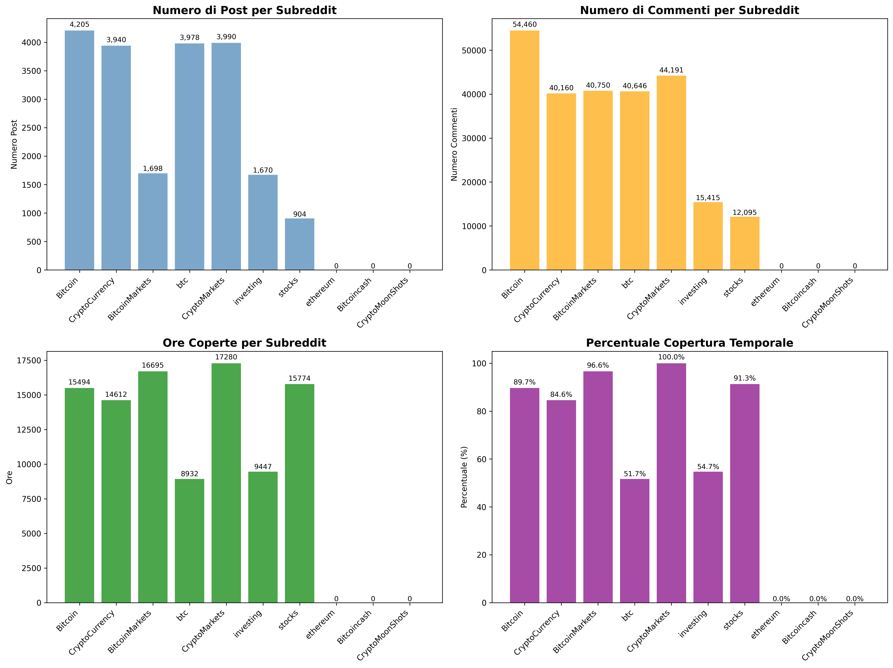

# Beyond Market Data: Reddit Sentiment for Hourly Bitcoin Forecasting (VADER vs FinBERT)

**BSc thesis** in Economics and Big Data at Università degli Studi Roma Tre (A.Y. 2024/25, supervisor: Prof. Francesco Benedetto).

Does what people say on Reddit help predict Bitcoin's next move? This project collects two years of hourly market data and ~85,000 Reddit posts and comments, scores them with two very different sentiment models, and tests rigorously whether sentiment adds predictive power beyond price data alone.

📄 Full thesis (Italian): [`docs/thesis.pdf`](docs/thesis.pdf)

---

## Research questions
1. Does Reddit sentiment improve short-horizon (1h / 4h) forecasts of BTC log-returns compared with market-only models?
2. Which sentiment model works better for this job: **VADER** (lexicon/rule-based) or **FinBERT** (finance-tuned Transformer)?
3. Are any improvements **statistically significant** or just noise?

## Data
| Source | Detail |
|---|---|
| Bitcoin OHLCV | Hourly, Sep 2023 to Aug 2025, **17,519 observations** |
| Reddit | 10 subreddits (r/Bitcoin, r/CryptoCurrency, r/BitcoinMarkets, r/btc, r/CryptoMarkets, r/investing, r/stocks, …), **~85k texts**, aggregated into hourly UTC buckets |
| Final dataset | 17,519 rows × **105 features** (lags, rolling stats on 3h/6h/24h windows, social volume, ~35 sentiment variables) |



## Pipeline
```
Reddit API (PRAW) ─┐                          ┌─ VADER compound
                   ├─► dedup + UTC bucketing ─┤                    ─► feature engineering ─► models ─► evaluation
yfinance (BTC 1h) ─┘                          └─ FinBERT (pos/neg/neu)   (lags, rolling,      Naïve     RMSE, MAE,
                                                                          volumes)            ARIMA     directional acc.,
                                                                                              LSTM      Diebold-Mariano,
                                                                                              XGBoost   Model Confidence Set
```

**Leakage control:** texts are assigned only to buckets with timestamp ≤ t; scalers/imputers are fit on train only; rolling-origin split 70/15/15 with no shuffling.

## Key findings
- At **1h**, sentiment gains are small and not systematic.
- At **4h**, the gaps between models shrink but become more reproducible. **XGBoost + VADER** is often among the best configurations.
- **Naïve and ARIMA baselines are very hard to beat**: normalised RMSE stays close to 1.
- VADER and FinBERT are weakly (sometimes negatively) correlated. FinBERT labels ~90% of texts as neutral, so the two models capture different constructs (a construct-validity issue).
- For near-real-time use, VADER gives the better cost/benefit trade-off.

An honest null-ish result: the value of social sentiment is context-dependent and much smaller than often claimed.

## Repository contents
This repository holds the **data-collection and sentiment-processing code** built for the thesis, plus exploratory correlation and LSTM experiments.

| Path | What |
|---|---|
| `src/reddit_scraper*.py`, `src/massive_data_collector.py` | Reddit collection via PRAW (credentials read from env vars) |
| `src/financial_data_downloader.py`, `src/quick_financial_downloader.py` | Hourly market data (BTC, ETH, S&P 500, NASDAQ, VIX, DXY) via yfinance |
| `src/finbert_sentiment_system.py`, `src/sentiment_analysis_baseline.py` | FinBERT and VADER scoring |
| `src/temporal_alignment_checker.py`, `src/alignment_validator.py` | Timestamp alignment and leakage checks |
| `src/comprehensive_correlation_analysis.py` | Sentiment ↔ return correlation analysis |
| `src/lstm_predictive_model.py`, `src/lstm_with_data_fix.py` | LSTM experiments |
| `src/monitoring_dashboard.py` | Collection monitoring dashboard |

## Reproduce
```bash
pip install -r requirements.txt
cp .env.example .env        # add your Reddit API credentials
python src/quick_financial_downloader.py
python src/massive_data_collector.py
python src/finbert_sentiment_system.py
python src/comprehensive_correlation_analysis.py
```
Run the scripts from the repository root: they read and write under `data/`. Raw data is not committed.

## Tech
Python · pandas · NumPy · PRAW · yfinance · Hugging Face Transformers (FinBERT) · vaderSentiment · scikit-learn · XGBoost · TensorFlow/Keras · statsmodels

---
**Author:** Emanuele Smisi
